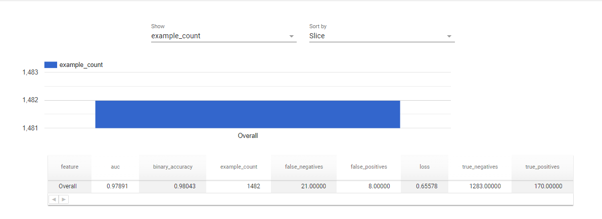

# Submission 1: Proyek Pengembangan Machine Learning Pipeline

Nama: Ahmad Ramadhan \
Username dicoding: dhadhan \
Email: ahmad.ramadhan@live.jp

|                         | Deskripsi                                                                                                                                                                                                                                                                                                                                                                                                                                                                                                                                                                                                                                                                                                                                                                                                                                                                                                                                                                                                                                                                                                                                                                                                                                                                                                                                                                                                                                                                                                                                                                                                                                                                                                                                                                                                                                                                                                                                                                                                                                                                                                                                                                                                                                                                                                                                                                                                                                                                                                                                                                                                                                                                                                                                                                                                                                                                                                                                                                                                                                                                                                                                                                                                                                                                                                                                                                                                                                                                                                                                                                                                                                                                                                                                                                                                                                                                                                                                                                                                                                                                                                                                                                                                                      |
| ----------------------- | ------------------------------------------------------------------------------------------------------------------------------------------------------------------------------------------------------------------------------------------------------------------------------------------------------------------------------------------------------------------------------------------------------------------------------------------------------------------------------------------------------------------------------------------------------------------------------------------------------------------------------------------------------------------------------------------------------------------------------------------------------------------------------------------------------------------------------------------------------------------------------------------------------------------------------------------------------------------------------------------------------------------------------------------------------------------------------------------------------------------------------------------------------------------------------------------------------------------------------------------------------------------------------------------------------------------------------------------------------------------------------------------------------------------------------------------------------------------------------------------------------------------------------------------------------------------------------------------------------------------------------------------------------------------------------------------------------------------------------------------------------------------------------------------------------------------------------------------------------------------------------------------------------------------------------------------------------------------------------------------------------------------------------------------------------------------------------------------------------------------------------------------------------------------------------------------------------------------------------------------------------------------------------------------------------------------------------------------------------------------------------------------------------------------------------------------------------------------------------------------------------------------------------------------------------------------------------------------------------------------------------------------------------------------------------------------------------------------------------------------------------------------------------------------------------------------------------------------------------------------------------------------------------------------------------------------------------------------------------------------------------------------------------------------------------------------------------------------------------------------------------------------------------------------------------------------------------------------------------------------------------------------------------------------------------------------------------------------------------------------------------------------------------------------------------------------------------------------------------------------------------------------------------------------------------------------------------------------------------------------------------------------------------------------------------------------------------------------------------------------------------------------------------------------------------------------------------------------------------------------------------------------------------------------------------------------------------------------------------------------------------------------------------------------------------------------------------------------------------------------------------------------------------------------------------------------------------------------------------ |
| Dataset                 | _[Email Spam Detection](https://www.kaggle.com/datasets/ashfakyeafi/spam-email-classification)_                                                                                                                                                                                                                                                                                                                                                                                                                                                                                                                                                                                                                                                                                                                                                                                                                                                                                                                                                                                                                                                                                                                                                                                                                                                                                                                                                                                                                                                                                                                                                                                                                                                                                                                                                                                                                                                                                                                                                                                                                                                                                                                                                                                                                                                                                                                                                                                                                                                                                                                                                                                                                                                                                                                                                                                                                                                                                                                                                                                                                                                                                                                                                                                                                                                                                                                                                                                                                                                                                                                                                                                                                                                                                                                                                                                                                                                                                                                                                                                                                                                                                                                                |
| Masalah                 | Email spam merupakan pesan-pesan yang tidak diinginkan yang dikirimkan secara massal kepada pengguna email dengan tujuan untuk mempromosikan produk, layanan, atau untuk _Cybercrime_ yang dapat merugikan pengguna email itu sendiri. Sehingga pengguna dituntut untuk mensortir email tersebut secara manual. Masalah selanjutnya adalah email spam tersebut terlalu banyak dan bercamour dengan email yang bukan spam. Dibutuhkan solusi digital untuk secara menghapus email spam tersebut secara otomatis.                                                                                                                                                                                                                                                                                                                                                                                                                                                                                                                                                                                                                                                                                                                                                                                                                                                                                                                                                                                                                                                                                                                                                                                                                                                                                                                                                                                                                                                                                                                                                                                                                                                                                                                                                                                                                                                                                                                                                                                                                                                                                                                                                                                                                                                                                                                                                                                                                                                                                                                                                                                                                                                                                                                                                                                                                                                                                                                                                                                                                                                                                                                                                                                                                                                                                                                                                                                                                                                                                                                                                                                                                                                                                                                |
| Solusi machine learning | Solusi yang diberikan adalah dengan menggunakan Machine Learning untuk mendeteksi apakah email tersebut spam atau bukan. Dengan adanya model deteksi email spam, pengguna akan mengalami peningkatan produktivitas karena tidak perlu lagi memilah-milah dan membuang waktu. Dan juga model deteksi email spam dapat membantu pengguna mengurangi risiko keamanan terkait dengan menerima dan membuka email yang mengandung _malware, phising_, atau penipuan lainnya. Dengan mencegah email spam masuk ke kotak masuk pengguna, solusi ini membantu melindungi data sensitif dan informasi pribadi dari ancaman _cyber_.                                                                                                                                                                                                                                                                                                                                                                                                                                                                                                                                                                                                                                                                                                                                                                                                                                                                                                                                                                                                                                                                                                                                                                                                                                                                                                                                                                                                                                                                                                                                                                                                                                                                                                                                                                                                                                                                                                                                                                                                                                                                                                                                                                                                                                                                                                                                                                                                                                                                                                                                                                                                                                                                                                                                                                                                                                                                                                                                                                                                                                                                                                                                                                                                                                                                                                                                                                                                                                                                                                                                                                                                      |
| Metode pengolahan       | Metode yang dipakai adalah dengan mempelajari karakteristik dari email spam dan bukan spam yang diberi nilai 1 untuk email Spam dan 0 untuk email yang bukan spam. data yang digunakan meliputi tokenisasi teks email, pembersihan teks dengan menghapus kolom yang tidak dibutuhkan dan juga penggunaan teknik pengkodean seperti `TF-IDF` atau `word embeddings` untuk merepresentasikan teks ke dalam bentuk _numerik_, dan pembagian dataset menjadi data `train` & `val`                                                                                                                                                                                                                                                                                                                                                                                                                                                                                                                                                                                                                                                                                                                                                                                                                                                                                                                                                                                                                                                                                                                                                                                                                                                                                                                                                                                                                                                                                                                                                                                                                                                                                                                                                                                                                                                                                                                                                                                                                                                                                                                                                                                                                                                                                                                                                                                                                                                                                                                                                                                                                                                                                                                                                                                                                                                                                                                                                                                                                                                                                                                                                                                                                                                                                                                                                                                                                                                                                                                                                                                                                                                                                                                                                  |
| Arsitektur model        | Arsitektur model yang digunakan adalah sebagai berikut:  <li> `Input Layer`: _Layer_ ini menerima input dalam bentuk teks email yang akan diproses. Teks kemudian akan diubah menjadi representasi numerik agar dapat dimengerti oleh model. </li> <li> `Layer Processing Text`: _Layer_ ini bertugas untuk mengubah teks menjadi representasi numerik. Hal ini dilakukan dengan memanfaatkan teknik seperti _tokenisasi_, pembersihan teks, dan pengkodean teks ke dalam bilangan bulat. Representasi numerik dari teks ini akan digunakan sebagai input untuk _layer_ selanjutnya. </li> <li> `Embedding Layer`: _layer_ ini menerjemahkan representasi numerik teks ke dalam ruang _vektor_ yang lebih rendah dimensi. Ini membantu model untuk mempelajari representasi yang lebih baik dari teks, dengan mempertahankan struktur dan hubungan antar kata-kata. </li> <li> `Rekuren Layer (RNN)`: Model menggunakan _layer_ LSTM atau GRU untuk memahami urutan kata-kata dalam teks. Lapisan ini memungkinkan model untuk memahami konteks dan urutan kata-kata dalam teks email, yang sering kali penting untuk mendeteksi apakah email tersebut spam atau bukan. </li> <li> `Fully Connected Layers`: Lapisan-lapisan ini bertanggung jawab untuk menggabungkan fitur-fitur yang dipelajari oleh lapisan sebelumnya dan melakukan klasifikasi apakah email tersebut spam atau bukan. Dengan menggunakan fungsi aktivasi sigmoid pada lapisan output, model mengeluarkan probabilitas bahwa sebuah email adalah spam.                                                                                                                                                                                                                                                                                                                                                                                                                                                                                                                                                                                                                                                                                                                                                                                                                                                                                                                                                                                                                                                                                                                                                                                                                                                                                                                                                                                                                                                                                                                                                                                                                                                                                                                                                                                                                                                                                                                                                                                                                                                                                                                                                                                                                                                                                                                                                                                                                                                                                                                                                                                                                                                                                    |
| Metrik evaluasi         | Metrik-metrik evaluasi yang digunakan untuk mengevaluasi performa model dalam kedua _script_ adalah sebagai berikut: <ol><li>`Binary Accuracy`: Metrik ini mengukur akurasi prediksi model untuk klasifikasi biner (spam atau bukan spam). Akurasi dihitung sebagai jumlah prediksi yang benar (positif dan negatif) dibagi dengan jumlah total sampel.</li><li>`Binary Crossentropy Loss`: Metrik ini mengukur seberapa baik model dalam membedakan antara kelas spam dan bukan spam dengan menggunakan fungsi kerugian _binary crossentropy_. Semakin rendah nilai _binary crossentropy_, semakin baik model dalam melakukan klasifikasi.</li><li>`Early Stopping`: _Callback_ ini digunakan untuk menghentikan pelatihan lebih awal jika tidak terjadi peningkatan dalam metrik evaluasi (misalnya: akurasi validasi) dalam beberapa epoch berturut-turut. Ini membantu mencegah _overfitting_ dan mempercepat proses pelatihan.</li><li>`Model Checkpoint`: _Callback_ ini digunakan untuk menyimpan model terbaik selama pelatihan berdasarkan metrik evaluasi tertentu (misalnya: akurasi validasi). Model yang disimpan dapat digunakan kembali nantinya tanpa harus menjalankan pelatihan dari awal. </li></ol>  Pada Metrik ini saya juga menggunakan tools _evaluator_ sebagai berikut:  <ul><li>`tfma.MetricConfig(class_name='ExampleCount')` </li></li> <li>`tfma.MetricConfig(class_name='AUC')` </li> <li>`tfma.MetricConfig(class_name='FalsePositives')` </li> <li>`tfma.MetricConfig(class_name='TruePositives')`</li> <li>`tfma.MetricConfig(class_name='FalseNegatives')`</li> <li>`tfma.MetricConfig(class_name='TrueNegatives')`</li> <li>Penetapan Ambang Akurasi (`BinaryAccuracy` dengan _threshold_)                                                                                                                                                                                                                                                                                                                                                                                                                                                                                                                                                                                                                                                                                                                                                                                                                                                                                                                                                                                                                                                                                                                                                                                                                                                                                                                                                                                                                                                                                                                                                                                                                                                                                                                                                                                                                                                                                                                                                                                                                                                                                                                                                                                                                                                                                                                                                                                                                                                                         |
| Performa model          | Pada model ini terdapat evaluasi modelnya berikut adalah penjelasannya: <ul><li>`tfma.MetricConfig(class_name='ExampleCount')`: sederhana saja melacak jumlah total email yang digunakan untuk pelatihan, validasi, dan evaluasi. </li></li> <li>`tfma.MetricConfig(class_name='AUC')`: menghitung _Area Under the ROC Curve (AUC)_. Ini mencerminkan kemampuan model untuk membedakan email spam dari non-spam di semua ambang klasifikasi. </li> <li>`tfma.MetricConfig(class_name='FalsePositives')`: menghitung email yang salah diklasifikasikan sebagai spam (kesalahan tipe I). </li> <li>`tfma.MetricConfig(class_name='TruePositives')`: menghitung email yang benar diklasifikasikan sebagai spam.</li> <li>`tfma.MetricConfig(class_name='FalseNegatives')`: menghitung email yang salah diklasifikasikan sebagai _non-spam_ (kesalahan tipe II).</li> <li>`tfma.MetricConfig(class_name='TrueNegatives')`: menghitung email yang benar diklasifikasikan sebagai _non-spam_.</li> <li>Penetapan Ambang Akurasi (`BinaryAccuracy` dengan _threshold_): Konfigurasi ini menetapkan ambang minimum untuk apa yang merupakan klasifikasi "akurat" sebagai spam. Secara _default_, menggunakan nilai 0.5, artinya model perlu setidaknya 50% yakin sebuah email adalah spam untuk mengklasifikasikannya sebagai spam. </li></ul> Berikut adalah hasil dari metrik evaluasinya:  1. `AUC (Area Under the ROC Curve)`:   Nilai Metrik: 0,97891   Keterangan: Nilai _AUC_ yang sangat tinggi ini (mendekati 1) menunjukkan bahwa model tersebut unggul dalam membedakan antara email spam dan non-spam. Ini secara efektif memisahkan dua kelas di semua ambang klasifikasi.  2. `Binary Accuracy`: Nilai Metrik: 0.98043 Keterangan: Model ini mencapai akurasi luar biasa sebesar 98,04% dalam mengklasifikasikan email sebagai spam atau bukan spam. Artinya, model tersebut hanya menghasilkan sedikit prediksi yang salah.  3. `Example Count`: Nilai Metrik: 1482 Keterangan: Model telah dilatih dan dievaluasi pada kumpulan data 1.482 sampel email. Ukuran sampel ini memberikan representasi distribusi data yang masuk akal untuk mengevaluasi performa model.  4. `False Negatives`: Nilai Metrik: 21.00000 Keterangan: Model salah mengklasifikasikan 21 email sebagai bukan spam padahal sebenarnya merupakan spam (kesalahan Tipe II). Ini mewakili tingkat Negatif Palsu sebesar 1,41%.  5. `False Positives`: Nilai Metrik: 8.00000 Keterangan: Nilai kerugian sebesar 0,65578 menunjukkan kesalahan model secara keseluruhan dalam memprediksi kelas yang benar untuk setiap email. Nilai kerugian yang lebih rendah menunjukkan kinerja yang lebih baik.  6. `Loss`: Nilai Metrik: 0.65578 Keterangan: Nilai _loss_ sebesar 0,65578 menunjukkan kesalahan model secara keseluruhan dalam memprediksi kelas yang benar untuk setiap email. Nilai kerugian yang lebih rendah menunjukkan kinerja yang lebih baik.  7. `True Negatives`: Nilai Metrik: 1283.00000 Keterangan: Model mengklasifikasikan 1283 email dengan benar sebagai bukan spam (kelas negatif). Ini mewakili tingkat True Negative sebesar 86,53%.  8. `True Positives`: Nilai Metrik: 170.00000 Keterangan: Model mengklasifikasikan 170 email dengan benar sebagai spam (kelas positif). Ini mewakili tingkat Positif Sejati sebesar 98,82%.  <b>Kesimpulan Keseluruhan</b>: Berdasarkan metrik yang diberikan, model pendeteksian email spam menunjukkan kinerja yang luar biasa untuk model ini. Tingkat `AUC`, `Binary Accuracy`, dan `True Positive/Negative` yang tinggi menunjukkan kemampuan model untuk membedakan secara akurat antara email spam dan non-spam. Rendahnya tingkat `False Positive` dan `False Negative` semakin menyoroti efektivitas model ini dalam meminimalkan kesalahan klasifikasi dan melindungi pengguna dari spam sekaligus menghindari gangguan yang tidak perlu pada kotak masuk mereka. |
| Kesimpulan              | Model yang telah dibangun dan dilatih telah mencapai hasil akurasi yang cukup bagus dan model ini telah dilakukan uji coba pada file `dhadhan-testing.ipynb` dan sudah berhasil mengidentifikasi apakah email tersebut spam atau bukan.                                                                                                                                                                                                                                                                                                                                                                                                                                                                                                                                                                                                                                                                                                                                                                                                                                                                                                                                                                                                                                                                                                                                                                                                                                                                                                                                                                                                                                                                                                                                                                                                                                                                                                                                                                                                                                                                                                                                                                                                                                                                                                                                                                                                                                                                                                                                                                                                                                                                                                                                                                                                                                                                                                                                                                                                                                                                                                                                                                                                                                                                                                                                                                                                                                                                                                                                                                                                                                                                                                                                                                                                                                                                                                                                                                                                                                                                                                                                                                                        |
| Opsi deployment         | test                                                                                                                                                                                                                                                                                                                                                                                                                                                                                                                                                                                                                                                                                                                                                                                                                                                                                                                                                                                                                                                                                                                                                                                                                                                                                                                                                                                                                                                                                                                                                                                                                                                                                                                                                                                                                                                                                                                                                                                                                                                                                                                                                                                                                                                                                                                                                                                                                                                                                                                                                                                                                                                                                                                                                                                                                                                                                                                                                                                                                                                                                                                                                                                                                                                                                                                                                                                                                                                                                                                                                                                                                                                                                                                                                                                                                                                                                                                                                                                                                                                                                                                                                                                                                           |
| Web app                 | [diabetes-classification](https://diabetes-classification-production.up.railway.app/v1/models/diabetes-classification-model/metadata)                                                                                                                                                                                                                                                                                                                                                                                                                                                                                                                                                                                                                                                                                                                                                                                                                                                                                                                                                                                                                                                                                                                                                                                                                                                                                                                                                                                                                                                                                                                                                                                                                                                                                                                                                                                                                                                                                                                                                                                                                                                                                                                                                                                                                                                                                                                                                                                                                                                                                                                                                                                                                                                                                                                                                                                                                                                                                                                                                                                                                                                                                                                                                                                                                                                                                                                                                                                                                                                                                                                                                                                                                                                                                                                                                                                                                                                                                                                                                                                                                                                                                          |
| Monitoring              | ws                                                                                                                                                                                                                                                                                                                                                                                                                                                                                                                                                                                                                                                                                                                                                                                                                                                                                                                                                                                                                                                                                                                                                                                                                                                                                                                                                                                                                                                                                                                                                                                                                                                                                                                                                                                                                                                                                                                                                                                                                                                                                                                                                                                                                                                                                                                                                                                                                                                                                                                                                                                                                                                                                                                                                                                                                                                                                                                                                                                                                                                                                                                                                                                                                                                                                                                                                                                                                                                                                                                                                                                                                                                                                                                                                                                                                                                                                                                                                                                                                                                                                                                                                                                                                             |

---

## Screenshoots

Metadata Tensorflow Serving Email Spam Detection\

